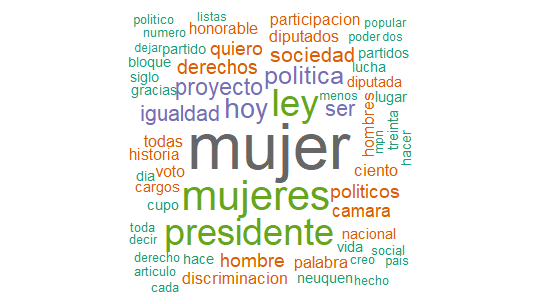
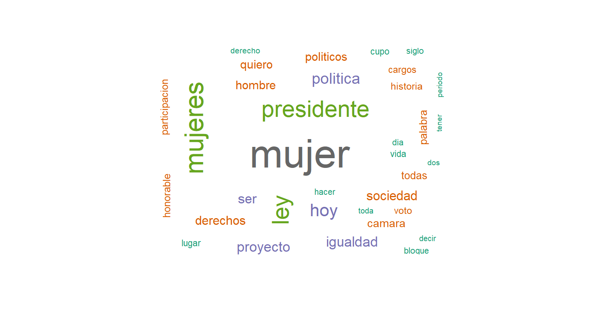
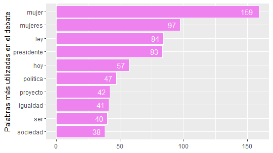

En este proyecto, se trabajó con el debate legislativo de la ley de cupo femenino en la provincia de Neuquén. La ley N° 2161 se aprobó por unanimidad el 8 de marzo de 1996 en la Cámara de Diputados provincial. El trabajo se llevó adelante aplicando herramientas de minería de texto de R con el objetivo de obtener algunos datos y visualizaciones que nos sirvan para un posterior análisis discursivo.

Para ello, nos centramos en el debate ocurrido en el recinto durante el tratamiento en general de la ley, que es el momento en que los diputados y las diputadas esgrimen su posición y sus argumentos con mayor profundidad. A partir de la versión taquigráfica, se aplicaron herramientas de limpieza y análisis de datos para recuperar algunas palabras claves del debate. También se elaboraron visualizaciones con las palabras más repetidas durante las intervenciones. 

La ley de cupo modificó el artículo 58 de la ley electoral provincial N° 165, estableciendo que las listas partidarias debían estar integradas en un mínimo de un 30% por candidatas mujeres. Creemos que su análisis es una herramienta importante para comprender las dinámicas políticas al momento de definir los alcances de la representatividad y las desigualdades de género que se producen en ese proceso. 
El análisis en R

Como primer paso, instalamos paquetes y encendimos las librerías que se utilizaron para trabajar con los datos.

<span style="color:green">#*### Instalación de paquetes ###*</span>

```
install.packages("tm")
install.packages("NLP")
install.packages("SnowballC")
install.packages("wordcloud")
install.packages("RColorBrewer")
install.packages("stringr")
```

<span style="color:green">#*### Carga de librerias ###*</span>

```
library(tm)
library(NLP)
library(SnowballC)
library(RColorBrewer)
library(wordcloud)
library(stringi)
library(stringr)
library(ggplot2)
```

Luego se cargaron los datos con los que se iban a trabajar. En este caso, un archivo .txt con la versión taquigráfica

<span style="color:green">#*### Carga de datos###*</span>

```
cupo <- readLines("C:/Users/lucre/Desktop/cupo/Ley de cupo.txt")
cupo = iconv(cupo, to="ASCII//TRANSLIT")
cupo = Corpus(VectorSource(cupo))
```


Se utilizó la función length (longitud) para conocer la extensión en palabras del debate. 

```
str(cupo)
str_length(cupo)
```

El resultado fue de 86131 palabras.

Como tercer paso, se hizo un proceso de limpieza mediante el cual se eliminaron puntuaciones, comas, espacios en blanco y se convirtió todo el texto en minúscula. También eliminamos las palabras vacías con “stopwords” y creamos el corpus a partir del vector 

<span style="color:green">#*### Limpieza y corpus###*</span>

```
debate_cupo <- cupo %>% 
  str_replace_all(., "[[:cntrl:]]", " ") %>% 
  str_to_lower() %>% 
  removePunctuation() %>% 
  str_replace_all(., "—", " ")

debate_cupo <- removeWords(debate_cupo, words = stopwords("spanish"))

debate_cupo <- stripWhitespace(debate_cupo)

corpus_cupo <- debate_cupo %>%  
  VectorSource() %>%
  Corpus()
```

Luego, comenzamos con el proceso de visualización de datos. Se realizó una nube de palabras (librería wordcloud) que nos muestra los términos más frecuentes usados por los diputados y diputadas que intervinieron durante el debate legislativo de la ley de cupo femenino.


<span style="color:green">#*### Nube de palabras ###*</span>

```
wordcloud(corpus_cupo, 
          min.freq = 5,
          max.words = 80, 
          random.order = FALSE, 
          colors = brewer.pal(name = "Dark2", n = 8))
```


Como quedaban palabras que eran de poco interés para el análisis, tales como “muchas”, “veces” y “sino”, entre otras, realizamos una segunda limpieza del texto.

```
a_retirar <- c("muchas", "veces", "siempre", "sino", "asi", "mas", 
               "tambien")

debate_cupo <- removeWords(debate_cupo, words = a_retirar)

corpus_cupo <- debate_cupo %>% 
  VectorSource() %>%
  Corpus()

wordcloud(corpus_cupo, 
          min.freq = 5,
          max.words = 80, 
          random.order = FALSE, 
          colors = brewer.pal(name = "Dark2", n = 8)
)
```


“Mujer”, “Mujeres” y “presidente” son las palabras que se utilizaron en el debate con mayor frecuencia. Se puede observar la presencia de palabras que hacen referencia a la igualdad y a los derechos en la participación política. 


El último paso fue trabajar con la frecuencia de palabras en cantidades, utilizando ggplot2 para hacer el gráfico. 

Para eso, primero transformamos nuestro objeto corpus_cupo en un objeto de clase matrix. Eso nos permitió tener las sumas de renglones ordenadas en forma decreciente para conocer la frecuencia de cada palabra. Con eso, transformamos los resultados a objeto de clase data.frame de dos columnas, palabra y frecuencia, y luego graficamos su contenido.

<span style="color:green">*###Frecuencia de palabras###*</span>

```
palabras <- corpus_cupo %>% 
  TermDocumentMatrix() %>% 
  as.matrix() %>% 
  rowSums() %>% 
  sort(decreasing = TRUE)

palabras %>% 
  head(20)

frecuencias <- data.frame(
  palabra = names(palabras),
  frecuencia = palabras
)

frecuencias[1:10,] %>% 
  ggplot() +
  aes(frecuencia, y = reorder(palabra, frecuencia)) +
  geom_bar(stat = "identity", color = "white", fill = "violet") +
  geom_text(aes(label = frecuencia, hjust = 1.5), color = "white") +
  labs(
    x = NULL,
    y = "Palabras más utilizadas en el debate"
  )
```



Observamos acá que tanto la palabra mujer como la palabra mujeres, que podrían agruparse en una misma categoría, son las que predominan el debate parlamentario de la ley de cupo. Están mencionadas en 256 oportunidades (159 mujer y 97 mujeres). También aparecen enunciadas en reiteradas ocasiones las palabras “ley” (84), “hoy” (57), “política” (47) e “igualdad” (41). Se trata de conceptos que dan cuenta de la necesidad de contar con una ley que otorgue una mayor igualdad a la representación política que había hasta el momento de su sanción (cabe aclarar que la paridad se lograría veinte años después en la provincia). 

El gráfico también nos muestra que la palabra “presidente” fue evocada 83 veces. Esta predominancia se explica por el mecanismo de funcionamiento del debate parlamentario en el recinto, en el que los diputados y diputadas deben dirigirse a la presidencia cuando hacen uso de la palabra. Y la presidencia de la Cámara era ejercida, por supuesto, por un varón. 


```{r setup, include=FALSE}
knitr::opts_chunk$set(echo = FALSE)

# Learn more about creating websites with Distill at:
# https://rstudio.github.io/distill/website.html

# Learn more about publishing to GitHub Pages at:
# https://rstudio.github.io/distill/publish_website.html#github-pages

```

